# Jak złożyć Skrzydło 90cm oraz 120cm
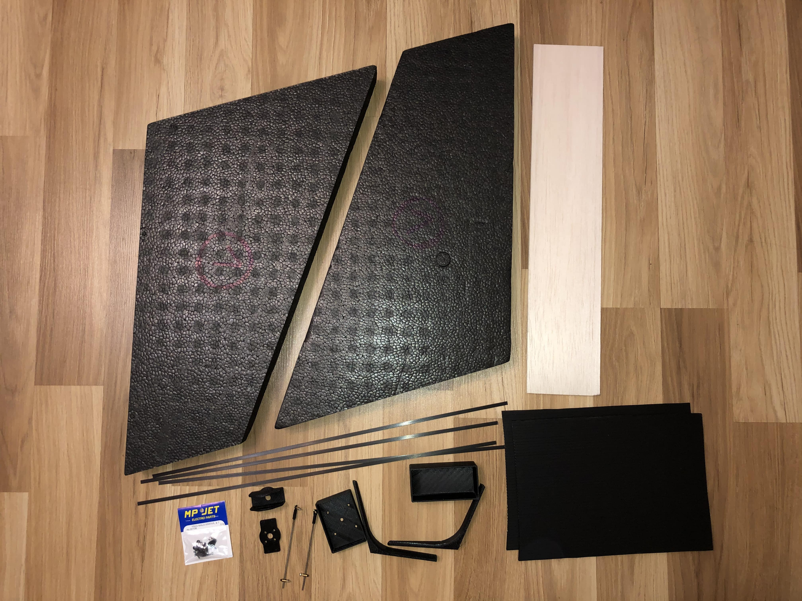

## Potrzebne rzeczy

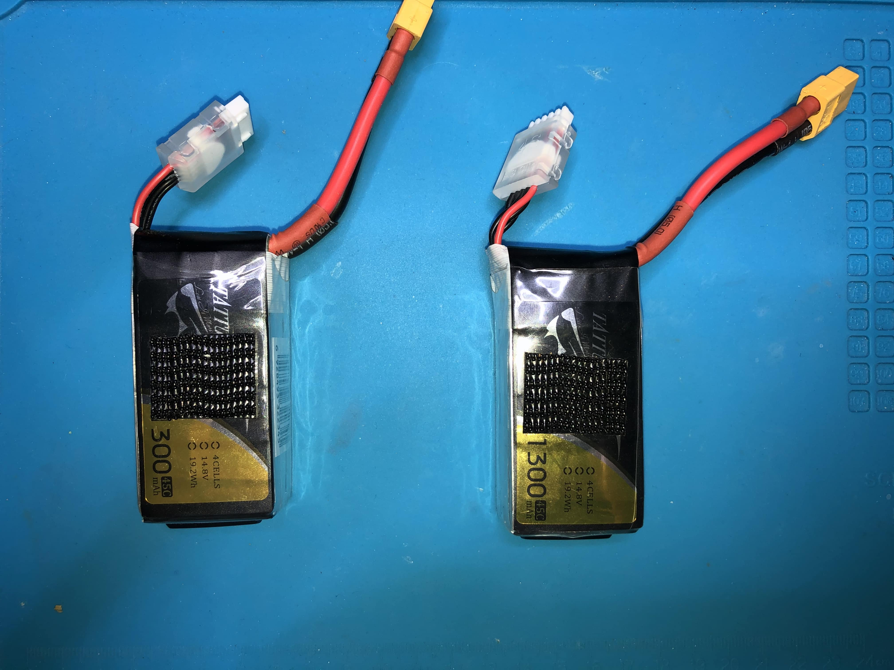

## Krok 1 - Klejenie połówek
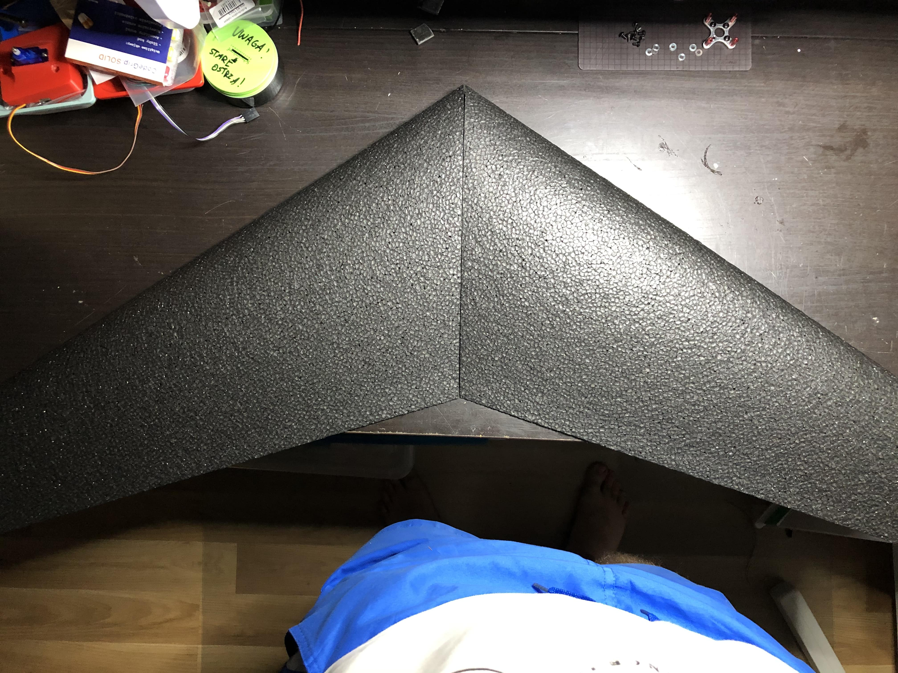
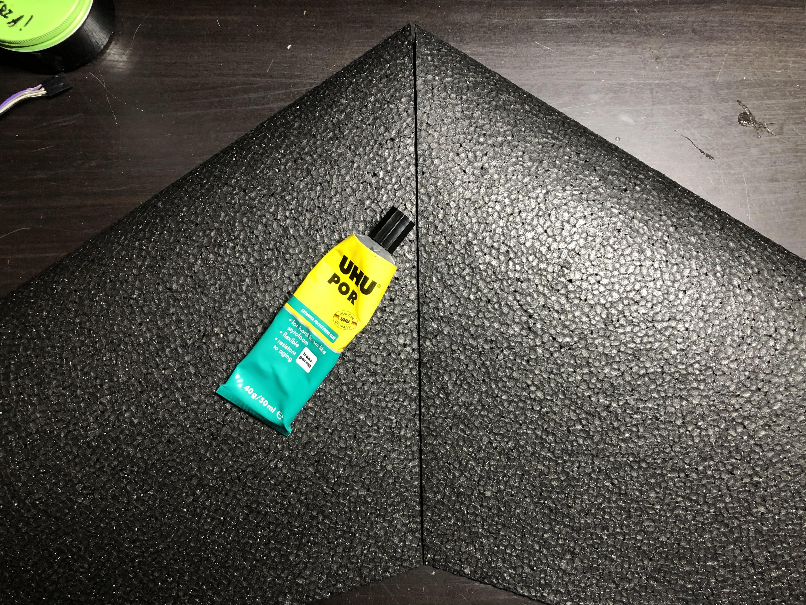
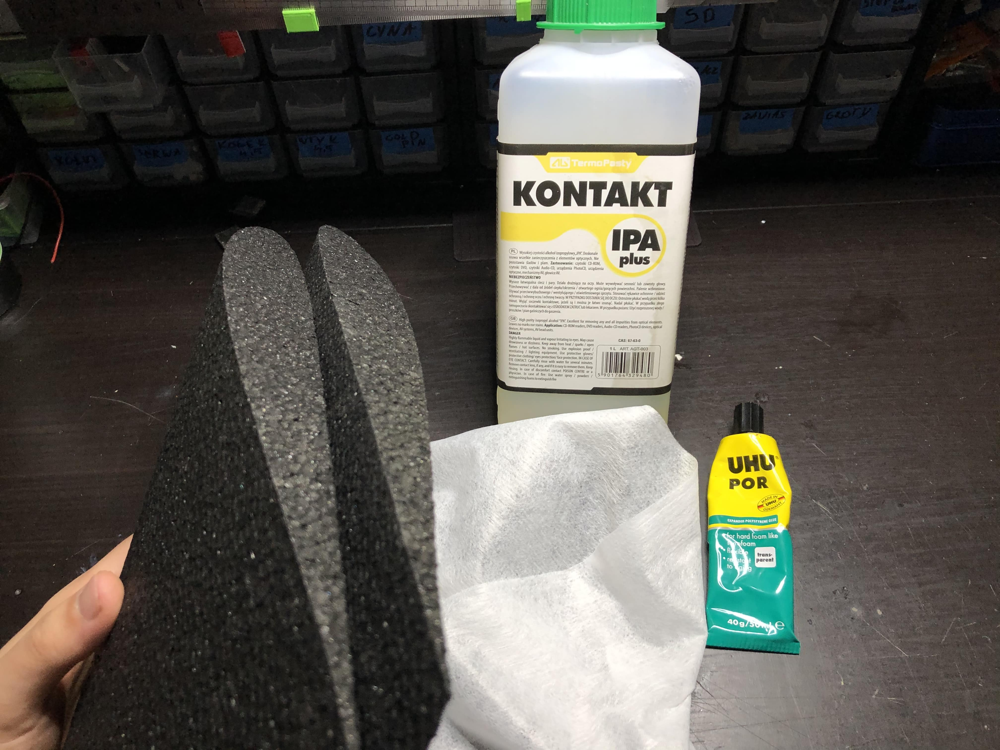
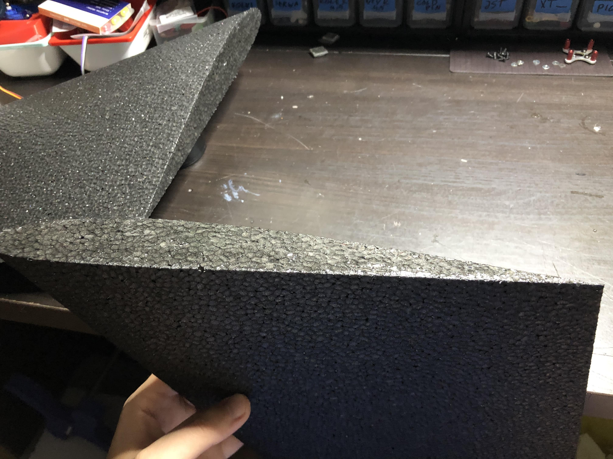
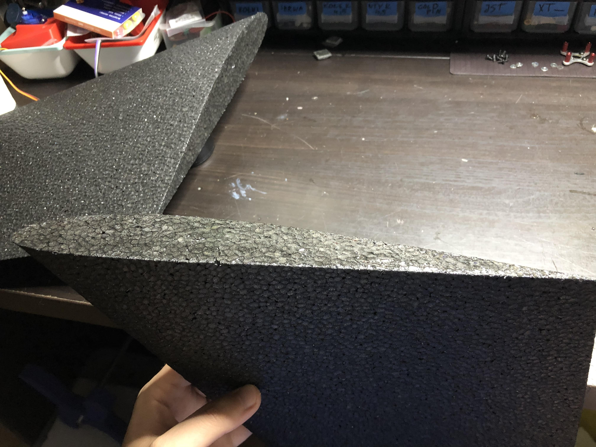
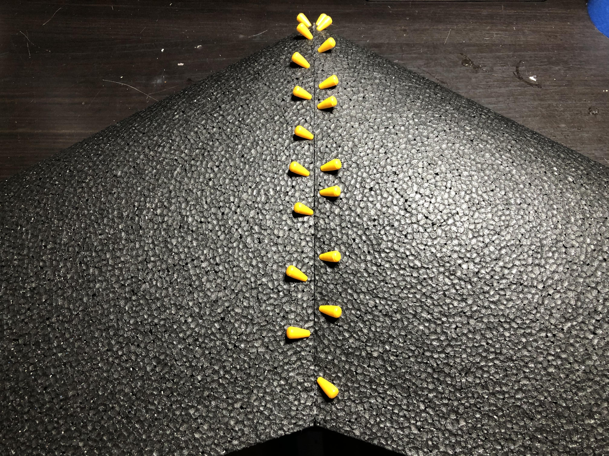

## Krok 2 - Docinanie
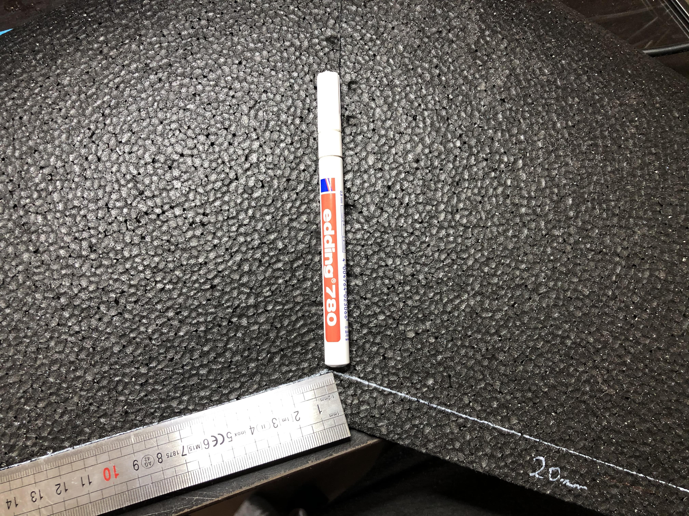

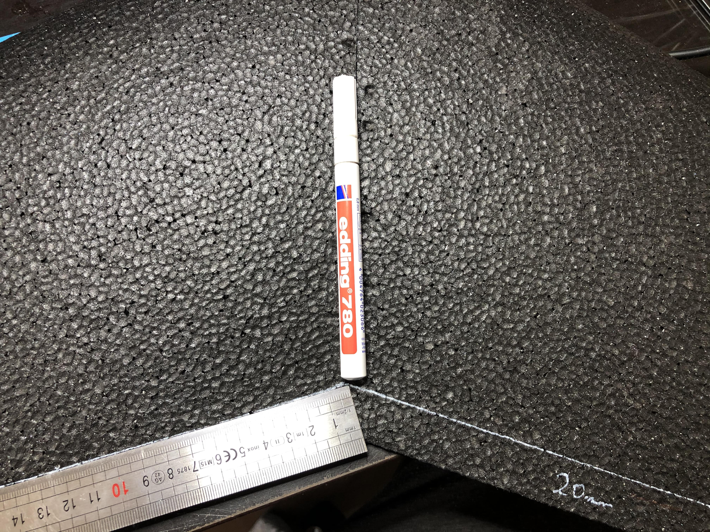
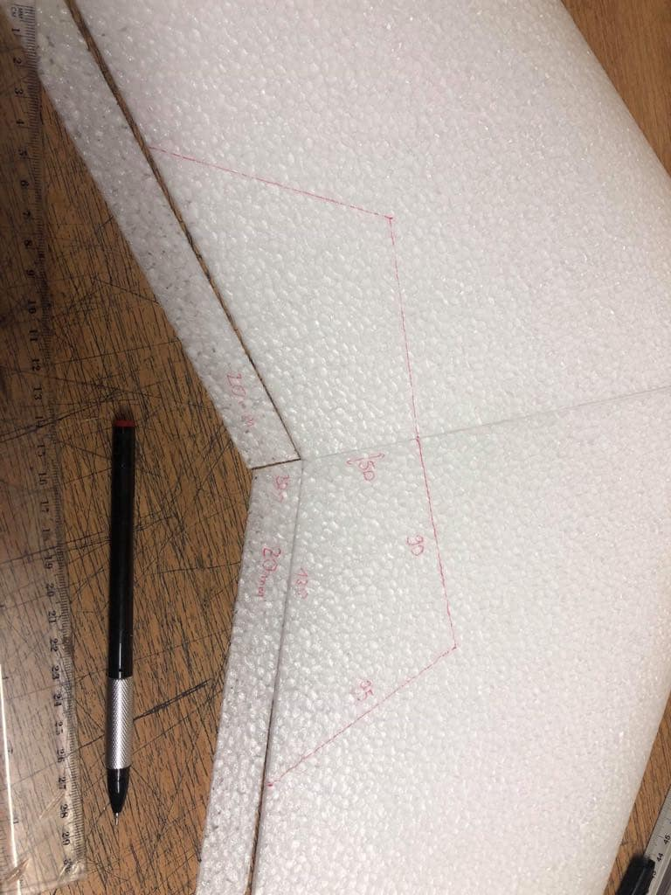
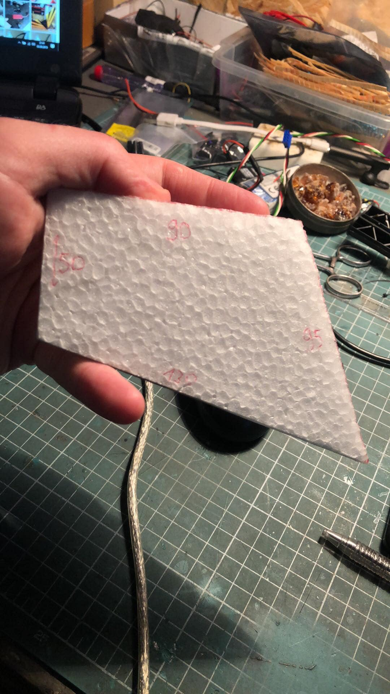

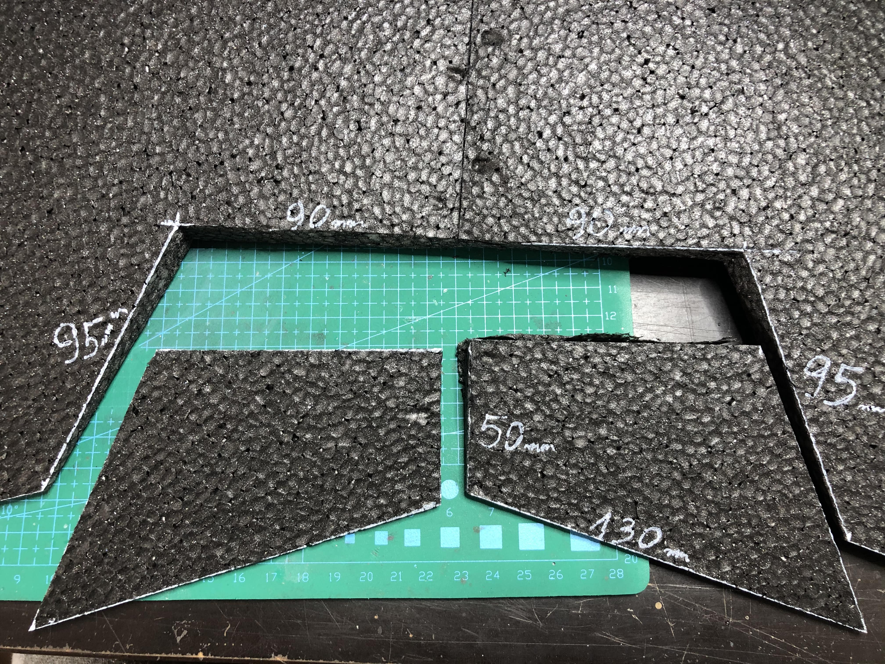

## Krok 3 - Wklejamy wzmocnienia
 
## Krok 4 - Mocujemy silnik

## Krok 5 - Wklejamy wzmocnienia 

## Krok 6 - Planowanie

## Krok 7 - Wklejamy serwa

## Krok 8 - Wklejamy FC bay

## Krok 9 - Wklejamy Battery bay

## Krok 10 - Wklejamy FPV

## Krok 11 - Lotki

## Krok 12 - Winglety

## Krok 13 - Oklejamy (opcjonalnie)

## Krok 14 - Wyważanie
 
## Krok 15 - Konfiguracja

## Krok 16 - Oblot
