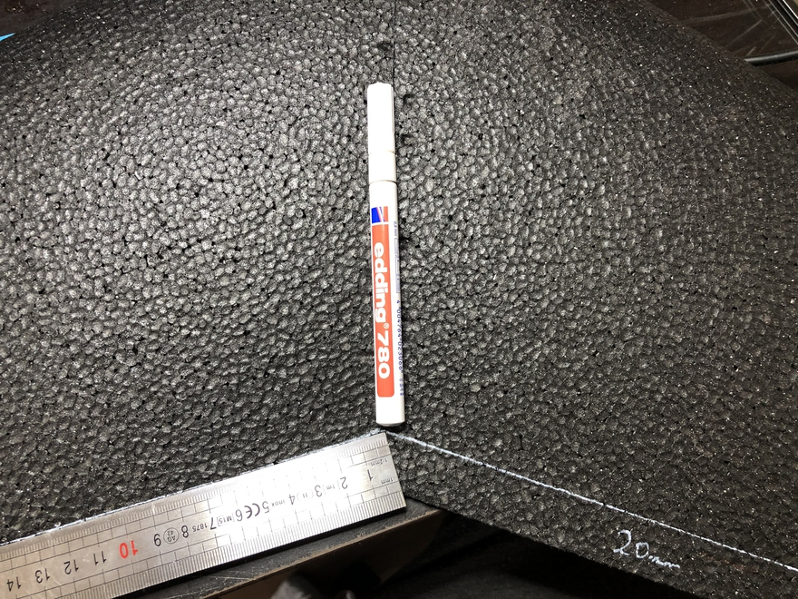

# Jak złożyć Skrzydło 90cm oraz 120cm
W tej instrukcji postaram się opisać Wam mój procez budowy skrzydełka od Dominika.

Budowa jest na wersji 90 ale z racji tego, że zbudowałem już 120 będę umieszczał też zdjęcia i uwagi dotyczące wersji 120.

## Potrzebne rzeczy
- Kit od Dominika :)
- 2x servo Emax 
- silnik Emax RS2205S 2300kv
- ESC Tattu 30A
- GPS BN-220
- Omnibus F4 v2
- Eachine 1000tvl
- FrSky XSR
- lipo 1300mah 4s
- UHU Por
- CA Joker Rzadki
- dodatkowo WS2812b

## Krok 1 - Klejenie połówek

## Krok 2 - Docinanie

## Krok 3 - Wklejamy wzmocnienia
 
## Krok 4 - Mocujemy silnik

## Krok 5 - Wklejamy wzmocnienia 

## Krok 6 - Planowanie

## Krok 7 - Wklejamy serwa

## Krok 8 - Wklejamy FC bay

## Krok 9 - Wklejamy Battery bay

## Krok 10 - Wklejamy FPV

## Krok 11 - Lotki

## Krok 12 - Winglety

## Krok 13 - Oklejamy (opcjonalnie)

## Krok 14 - Wyważanie
 
## Krok 15 - Konfiguracja

## Krok 16 - Oblot
